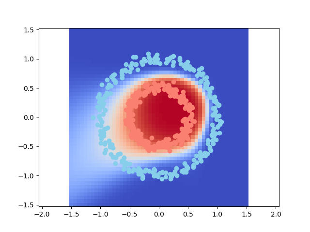

# Simple NN

This is a simple neural network implementation in Python. It is not optimized for speed, but it is optimized for readability. It is meant to be a learning tool for people who want to understand how neural networks work.

Reference  
https://www.youtube.com/watch?v=W8AeOXa_FqU